# Variables

In Navi Stream we have 3 keywords to store value: `let`, `var` and `varip`.

The syntax of variable declarations is:

```
[<declaration_mode>] :[<type>] <identifier> = <expression>
```

where:

- `declaration_mode` - is the variable mode, we can use `let`, `var`, `varip` 3 kinds.
- `type` - used to declare the variable type, such as `number`, `string` (optional parameter).
- `identifier` - variable name.
- `expression` - the value of the variable, can be any expression.

## let

`let` for define a mutable variable. Like `let` in JavaScript.

::: info
We don't have mutable and inmutable types in Navi Stream, so you can change the value of a variable at any time.
:::

```nvs
let b = 8;
let a = 1 + b;
// Now `a` value is 9

a += 2;
// Now `a` value is 11
```

You can assignment a new value to a variable at any time.

```nvs
let a = 1;
a = 2;
a = 3;
```

## var

`var` use for stream processing, it's like `let` but it's reset to the initial value at the end of each period.

::: tip
`var` is a periodic `let`, its value is only fixed at the end of each period, and other times it is reset to the value at the beginning of the period.
:::

The following example shows how to use `var` to calculate the current period:

```nvs
var bar = 0;

bar += 1;
```

After run the code, we can get the following result:

| idx | bar |
| --- | --- |
| 1   | 0   |
| 2   | 0   |
| 3   | 0   |
| 4   | 0   |
| 5   | 1   |
| 6   | 1   |
| 7   | 1   |
| 8   | 1   |
| 9   | 1   |
| 10  | 2   |

The result is consistent with the 5m periodic rule, you can see that the value of `var` variable is only determined at the end of the last 5m.

The following diagram shows the change of the `var` variable:

```mermaid
gantt
title Trade (5m)
dateFormat HH:mm

section Periods
period 1          :m1, 10:00, 5m
period 2          :m1, 10:05, 5m
period 3          :m1, 10:10, 1m
section Navi Stream var
var bar = 0    :n1, 10:00, 1m
bar is 1        :n1, 10:05, 1m
bar is 1        :n1, 10:06, 1m
bar is 1        :n1, 10:09, 1m
bar is 2        :n1, 10:10, 1m
```



## varip

`varip` use for stream processing, ensure that the value of each period is independent.

### Use case

| idx | time  | price  | volume |
| --- | ----- | ------ | ------ |
| 1   | 10:00 | 100.25 | 300    |
| 2   | 10:01 | 100.50 | 200    |
| 3   | 10:02 | 100.75 | 100    |
| 4   | 10:03 | 101.00 | 300    |
| 5   | 10:04 | 101.25 | 200    |
| 6   | 10:05 | 101.50 | 100    |
| 7   | 10:06 | 101.75 | 300    |
| 8   | 10:07 | 102.00 | 200    |
| 9   | 10:08 | 102.25 | 100    |
| 10  | 10:09 | 102.50 | 300    |
| 11  | 10:10 | 102.75 | 200    |

Now, we use `varip` to calculate the total amount of each period (5m):

```nvs
varip total_amount = 0;

total_amount += trade.volume;
```

If we calculate it, we can get:

| idx | total_amount |
| --- | ------------ |
| 1   | 300          |
| 2   | 500          |
| 3   | 600          |
| 4   | 900          |
| 5   | 1100         |
| 6   | 1200         |
| 7   | 1500         |
| 8   | 1700         |
| 9   | 1800         |
| 10  | 2100         |
| 11  | 2300         |

### barstate.is_confirmed

::: warning
Navi Stream's calculation cycle is a little special, the last data in each cycle (period) **will be calculated twice**, the last data will be calculated once in **confirmed** mode.

When in the last data of the period, `barstate.is_confirmed` is `true`, so we need to judge it to avoid `total_amount` being calculated twice.
:::

We expected to output data only at the end of each period, so we can write like this:

```nvs
varip total_amount = 0;

if (barstate.is_confirmed) {
  alert(`total_amount: {total_amount}`);
} else {
  total_amount += trade.volume;
}
```

Then Navi Stream well send `alert` like this:

| idx | total_amount        |
| --- | ------------------- |
| 5   | "total_amount 1100" |
| 11  | "total_amount 2300" |
