# 变量

在 Navi Stream 中我们有 3 种关键字来存储值：`let`、`var` 和 `varip`。

变量声明的语法是：

```
[<declaration_mode>] :[<type>] <identifier> = <expression>
```

其中：

- `declaration_mode` - 是变量模式，我们可以使用 `let`、`var`、`varip` 3 种。
- `type` - 用于声明变量类型，如 `number`、`string`（可选参数）。
- `identifier` - 变量名。
- `expression` - 变量的值，可以是任何表达式。

## let

`let` 用于定义一个可变变量，类似于 JavaScript 中的 `let`。

::: info
我们在 Navi Stream 中没有可变和不可变类型，所以你可以随时更改变量的值。
:::

```nvs
let b = 8;
let a = 1 + b;
// Now `a` value is 9

a += 2;
// Now `a` value is 11
```

你可以随时为变量赋新值。

```nvs
let a = 1;
a = 2;
a = 3;
```

## var

`var` 用于流处理，它类似于 `let`，但是在每个周期结束时重置为初始值。

:::success
`var` 是一个周期性的 `let`，它的值只在每个周期结束时才固定，其他时间它会重置为周期开始时的值。
:::

下面的示例展示了如何使用 `var` 来计算当前周期：

```nvs
var bar = 0;

bar += 1;
```

当我们运行这段代码后），我们可以得到以下结果：

| idx | bar |
| --- | --- |
| 1   | 0   |
| 2   | 0   |
| 3   | 0   |
| 4   | 0   |
| 5   | 1   |
| 6   | 1   |
| 7   | 1   |
| 8   | 1   |
| 9   | 1   |
| 10  | 2   |

上面的结果符合 5m 周期规则，你可以看到 `var` 变量的值只在最后一个 5m 结束时才确定。

下面的流程图展示了 `var` 变量的变化：

```mermaid
gantt
title Trade (5m)
dateFormat HH:mm

section Periods
period 1          :m1, 10:00, 5m
period 2          :m1, 10:05, 5m
period 3          :m1, 10:10, 1m
section Navi Stream var
var bar = 0    :n1, 10:00, 1m
bar is 1        :n1, 10:05, 1m
bar is 1        :n1, 10:06, 1m
bar is 1        :n1, 10:09, 1m
bar is 2        :n1, 10:10, 1m
```



## varip

`varip` 用于流处理，它类似于 `var`，但是在每个周期结束时重置为初始值，并且在每个周期结束时输出一个值。

### Use case

| idx | time  | price  | volume |
| --- | ----- | ------ | ------ |
| 1   | 10:00 | 100.25 | 300    |
| 2   | 10:01 | 100.50 | 200    |
| 3   | 10:02 | 100.75 | 100    |
| 4   | 10:03 | 101.00 | 300    |
| 5   | 10:04 | 101.25 | 200    |
| 6   | 10:05 | 101.50 | 100    |
| 7   | 10:06 | 101.75 | 300    |
| 8   | 10:07 | 102.00 | 200    |
| 9   | 10:08 | 102.25 | 100    |
| 10  | 10:09 | 102.50 | 300    |
| 11  | 10:10 | 102.75 | 200    |

现在，我们想要计算每个周期（5m）的总量，我们可以使用 `varip` 来计算：

```nvs
varip total_amount = 0;

total_amount += trade.volume;
```

如果我们计算它，我们可以得到：

| idx | total_amount |
| --- | ------------ |
| 1   | 300          |
| 2   | 500          |
| 3   | 600          |
| 4   | 900          |
| 5   | 1100         |
| 6   | 1200         |
| 7   | 1500         |
| 8   | 1700         |
| 9   | 1800         |
| 10  | 2100         |
| 11  | 2300         |

### barstate.is_confirmed

::: warning
Navi Stream 的计算周期有点特殊，每个周期（期间）的最后一个数据**将被计算两次**，最后一个数据将在**确认**模式下计算一次。

在最后一个数据是，`barstate.is_confirmed` 的状态为 `true`，所以我们可以判断它，以避免 `total_amount` 被计算两次。
:::

我们期望只在每个周期结束时输出数据，所以我们可以这样写：

```nvs
varip total_amount = 0;

if (barstate.is_confirmed) {
  alert(`total_amount: {total_amount}`);
} else {
  total_amount += trade.volume;
}
```

这样一来，Navi Stream 将会发送 `alert`，如下所示：

| idx | total_amount        |
| --- | ------------------- |
| 5   | "total_amount 1100" |
| 11  | "total_amount 2300" |
